# OpenLANE Workshop

This repository used to document the progress of the 5-days workshop on Physical design using OpenLANE flow(an orchestra of open source tools put together to build/create an open source community of digital and analog IP's).

## Day Progress & Learnings

During the workshop, most of the labs are performed using a pre-coded picorv32a project.

## Day 1: Introduction to OpenLANE Flow

### Lab Work

#### Invoking OpenLANE

1. Invoking the openLANE using `./flow.tcl -interactive`.
   The chip design is an iterative process, hence interactive mode offers better control and flexibility.

2. Load required dependencies of openLANE using following Command.
   `package require openlane 0.9`

   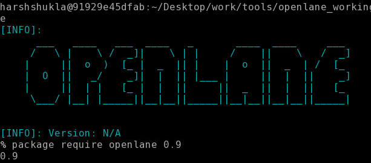

#### Preparing Design

All the designs are kept at the `/openlane_working_dir/designs`. For the workshop, 'picorv32a' design has been used.

The command used for setting up the design with 'LEF' and 'TECH' file. The 'LEF' file format contains information related to the terminals, different layers, dimensions etc, where Tech files contains layer definition and design rule checks(DRC).

Set 'LIB_SYNTH' variable to the `./openlane_dir/pdks/sky130A/libs.ref/sky130_fd_sc_hd/lib/sky130_fd_sc_hd_tt_025C_1v80.lib`. This liberty file contains Standard cell characteristics for 25 Deg Celsius Temperature and 1.8V. Add this variable in the config.tcl file present in the picorv32a folder.             
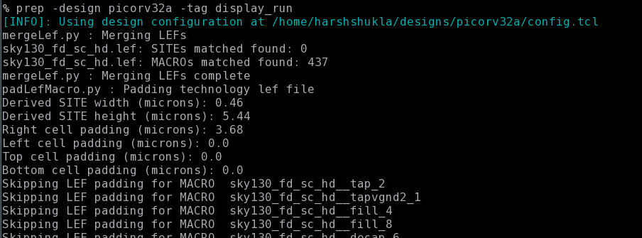             

#### Running Synthesis
Use command `run_synthesis`                                                                                               
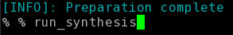                                                                      
File resulted from the synthesis                                                                           
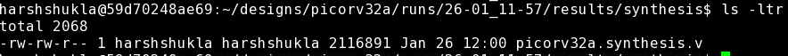

## Day 2: Floorplanning and Placement

### Floorplanning

Floorplanning includes placement of I/O pads and macros as well as power planning(Note: OpenLANE flow allows Power Planning post CTS).

#### Floorplan Control Parameters

1. Aspect Ratio: This determine the shape and size of the chip. It is defined as ratio of height to width.
   Note: Aspect Ratio 1 means shape is square.

2. Core Utilization: Core Utilization defined as the total area occupied by the netlist to the total area of the core.
   if Core Utilization is 0.6 then it means 40% of the area is going to be used for routing purposes.

For more control parameter refer to [openLANE configuration Readme](https://github.com/efabless/openlane/blob/master/configuration/README.md)

#### Decoupling Capacitor

#### Importance of Power Planning

#### Executing Floorplanning on openLANE

Run Command `run_floorplan` after adjusting proper control parameters in config.tcl.

Command generates 'DEF' file in the folder `/designs/picorv32a/run/<setup-folder>/results/floorplan/`
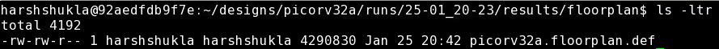

***Viewing 'DEF' file using Magic***
Magic requires three files to view Picorv32a DEF file:
   1. Magic Tech file: sky130A.tech
   2. LEF File: Merged.lef
   3. DEF File: Any Def file generated using this LEF file
Command to run magic:
`magic -T <Tech File> lef read <LEF File> def read <DEF File> &`
Floorplan result:                                                      
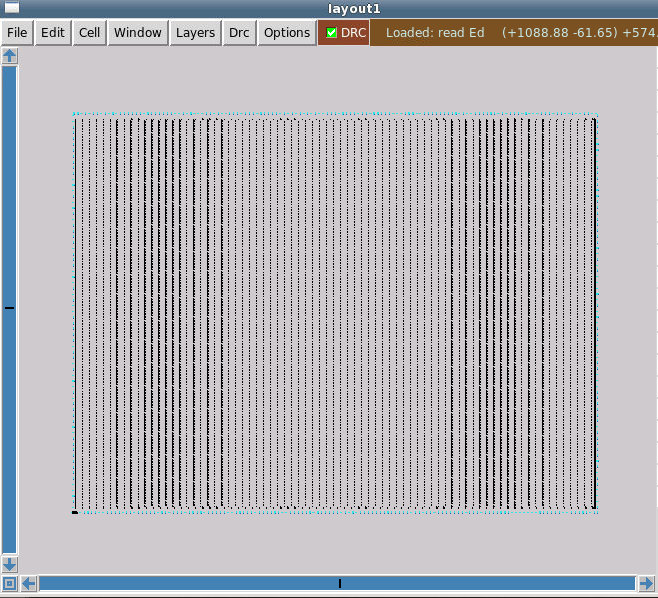

#### Executing Placement on openLANE

After Floorplan, next step(in physical design) is the placement stage. Standard cells has been mapped as per the synthesized netlist and their standard rows are determined by the floorplan.

Placement in OpenLANE happens in two stages. First stage is the Global placement in which placements of the cells are not legalized. Followed by Detailed Placement in which proper legalization is considered.

***Run Placement Command:*** `run_placement`                                                                                    
***Placement Result:***                                        
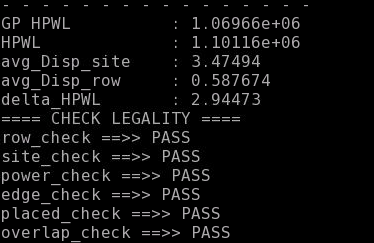                          
Placement result on Magic:                                                                           
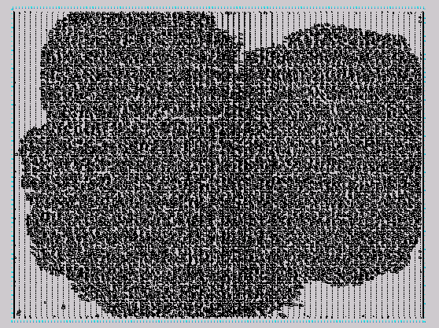                 

## Day 3: Standard Cell Analysis

In this section of the workshop, a pre-build inverter was analyzed in the OpenLane flow using ngspice and magic PEX extraction to obtain .spice file of the inverter which further analyzed in the ngspice 31.

To clone the cell use following command: `git clone https://github.com/nickson-jose/vsdstdcelldesign`

File of interest in the cloned repo is sky130A_inv.mag file and to view the layout of the cell using Magic .tech file is required. Hence, copy the sky130A.tech file to this cloned repo as shown below:
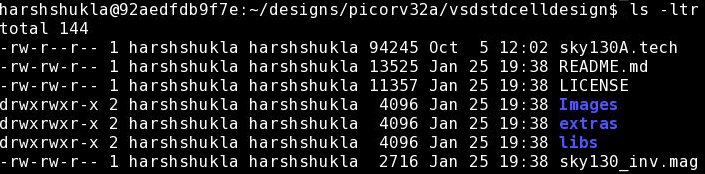 
### View Cell in Magic
Run command `magic -T sky130A.tech sky130A_inv.mag &`

### SPICE Extraction for Parasitics
To extract the parasitics type following command on the magic terminal:
``` 
% extract all
% ext2spice cthresh 0 rthresh 0
% ext2spice 
```                             
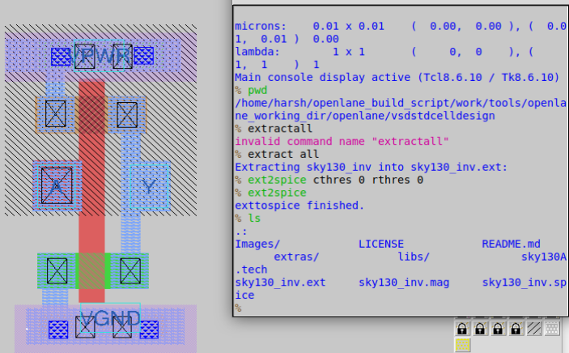 

As shown in the above image this command will generate two files 'sky130_inv.ext' and 'sky130_inv.spice'.

### Cell Transient Simulation using .spice file
In order to do transient simulation in ngspice following changes were made in the file:
   1. Add pshort.lib and nshort.lib files using '.include' statement.
   2. As pshort.lib does not have any model by the name of pshort. Hence replace pshort with pshort_model.0. Also, replace nshort with nshort_model.0 for same reason.
   3. Provide supplies using dc supplies to VA and VSS. 
   4. Provide pulse signal to the port A.
   5. Add simulation setup: .tran 1n 20n (1ns step and simulation time 20ns)
   6. Change the scale to 0.01u
   7. Add .control to perform run inside the same file.
   
Spice file after all the changes:            
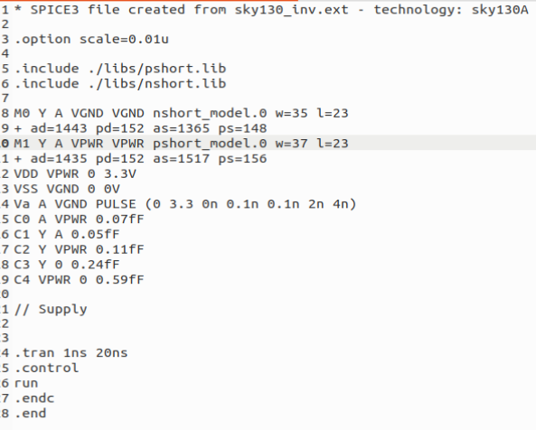

Exceute Simulation using command: `ngspice sky130_inv.spice`
Followed by `ngspice-> plot y vs time a` in the ngspice command line.
Results in following plot:             
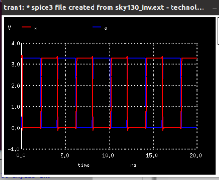

## Day 4: Timing Analysis using OpenSTA and Clock Tree Synthesis

### Cell Dimension Guide
Input and Output ports should be placed such that port should intersect the odd multiples of track pitch especially of the locali and metal layers. This dimension infomration is presented in the LEF files. 

Considering that add grid to magic using following command:
`% grid 0.46um 0.34um 0.23um 0.17um`
From below image, it is confirm that both A and Y lies on the odd mutiples of the track.
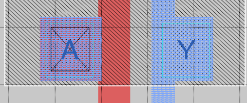

As seen in the above image port A and Y, this label "A"
